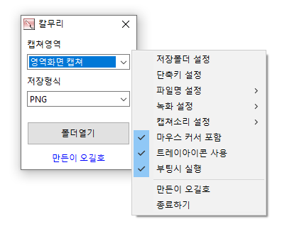

# 칼무리

**전체 화면·영역·창·웹 페이지 전체를 단축키 한 번으로 캡처하고, 화면을 MP4 동영상으로 녹화하는 Windows 무료 캡처 프로그램.**

[English](README.md) · 한국어 · [简体中文](README.zh-CN.md) · [日本語](README.ja.md) · [Español](README.es.md) · [Português (Brasil)](README.pt-BR.md) · [Français](README.fr.md)

## 개요

칼무리는 무엇을 캡처할지(**캡쳐영역**)와 어떻게 남길지(**저장형식**) 두 가지만 골라 두면, 그다음부터는 `PrintScreen` 한 번으로 캡처가 끝나는 프로그램입니다. 캡처할 때마다 창을 열거나 파일 이름을 입력할 필요가 없고, 결과는 저장 폴더에 `K-001.png`, `K-002.png` … 순서로 쌓입니다.

화면 전체, 늘 같은 자리의 영역, 마우스로 끈 부분, 지금 쓰는 창, 창 안의 버튼 하나, 스크롤이 긴 웹 페이지 전체까지 캡처할 수 있습니다. 같은 단축키로 화면을 MP4 동영상으로 녹화하고, 화면의 색상 코드를 뽑고, 이미지 속 글자를 텍스트로 옮길 수도 있습니다.

창을 닫아도 작업 표시줄 알림 영역(트레이)에서 계속 동작하므로, 한 번 켜 두면 언제든 단축키로 바로 캡처할 수 있습니다.

## 주요 기능

- **7가지 캡처 영역** — 전체 화면, 지정한 영역, 마우스로 끈 영역, 활성 창, 창 컨트롤, 웹 페이지 전체, 색상 추출.
- **다양한 저장 형식** — PNG · JPG · GIF · BMP · WebP 파일, MP4 동영상, 글자 인식(TXT), 클립보드, 이미지 공유, 프린터, 화면에 띄우기(플러팅).
- **화면 녹화** — 전체 화면이나 지정한 영역을 MP4 로 녹화하고, PC 에서 나는 소리도 함께 담을 수 있습니다.
- **웹 페이지 전체 캡처** — Edge · Chrome 으로 연 페이지를 스크롤 끝까지 한 장의 이미지로 저장합니다.
- **글자 인식(OCR)** — 캡처한 화면의 글자를 텍스트 파일로 저장합니다.
- **색상 추출** — 커서 아래 색을 HEX · RGB · Web · TColor 형식으로 복사합니다.
- **캡처 이미지 공유** — 캡처를 웹에 올리고 바로 열어 주소를 공유합니다.
- **플러팅** — 캡처한 이미지를 그 자리에 항상 위로 띄워 두고 참고합니다.
- **키보드로 영역 조절** — 방향키 · `Ctrl`+방향키 · `Shift`+방향키로 영역을 1픽셀 단위까지 맞춥니다.
- **편리한 설정** — 단축키 변경, 파일 이름 형식(순번 · 날짜시간), 캡처 소리, 마우스 커서 포함, 부팅 시 실행.
- **8개 언어** — 한국어 · 영어 · 일본어 · 중국어 · 러시아어 · 이탈리아어 · 프랑스어 · 스페인어.

## 다운로드 / 설치

| 종류 | 링크 |
|---|---|
| 설치판 | [다운로드](https://down.kilho.net/kalmuri?lang=ko) |
| 무설치판 (ZIP) | [다운로드](https://down.kilho.net/kalmuri?lang=ko&nosetup) |

설치판은 설치가 끝나면 칼무리를 바로 실행하고, **부팅시 실행** 을 켜 두어 Windows 를 켤 때마다 트레이에서 자동으로 시작합니다. 무설치판은 ZIP 을 풀고 `Kalmuri.exe` 를 실행하면 됩니다.

무설치판에는 실행 파일만 들어 있어 **MP4(동영상) 녹화와 WebP 저장은 설치판에서만** 쓸 수 있습니다. 나머지 기능은 두 판이 같습니다.

## 사용법

### 처음 사용하기

1. 칼무리를 실행하면 작은 창이 뜨고, 작업 표시줄 알림 영역에 칼무리 아이콘이 생깁니다.
2. **캡쳐영역** 에서 무엇을 캡처할지 고릅니다. 처음에는 **전체화면 캡쳐** 입니다.
3. **저장형식** 에서 어떻게 남길지 고릅니다. 처음에는 **PNG** 입니다. JPG · WebP 를 고르면 옆에 화질 칸이, TXT 를 고르면 인식 언어 칸이 나타납니다.
4. `PrintScreen` 을 누릅니다. 찰칵 소리와 함께 캡처되어 저장 폴더(처음에는 바탕 화면)에 `K-001.png` 로 저장됩니다.
5. **폴더열기** 를 누르면 저장 폴더가 열려 결과를 바로 확인할 수 있습니다.
6. 창을 닫아도 칼무리는 트레이에서 계속 동작합니다. 트레이 아이콘을 누르면 창이 다시 뜨고, 창이나 트레이 아이콘에서 **마우스 오른쪽 클릭** 을 하면 설정 메뉴가 나옵니다.

### 화면 구성

**메인 창**

| 요소 | 역할 |
|---|---|
| **캡쳐영역** | 무엇을 캡처할지 고릅니다 (아래 표) |
| **저장형식** | 캡처를 어떻게 남길지 고릅니다 (아래 표). JPG · WebP 는 화질(100 ~ 60), TXT 는 인식 언어 칸이 옆에 나옵니다 |
| **폴더열기** | 저장 폴더를 탐색기로 엽니다 |
| **만든이 오길호** | 칼무리 소개 페이지를 엽니다 |

**캡쳐영역**

| 항목 | 캡처하는 것 |
|---|---|
| **전체화면 캡쳐** | 화면 전체 |
| **영역화면 캡쳐** | 빨간 테두리 창 안쪽 — 늘 같은 자리·크기를 캡처할 때 |
| **드래그영역 캡쳐** | 단축키를 누른 뒤 마우스로 끌어 고른 부분 |
| **활성중인 화면 캡쳐** | 지금 쓰고 있는 창 하나 |
| **윈도우 컨트롤 캡쳐** | 마우스 커서 아래의 창이나 버튼·패널 같은 창 속 요소 |
| **웹페이지 캡쳐** | Edge · Chrome 에서 보고 있는 웹 페이지 전체(스크롤 끝까지) |
| **색상 추출** | 마우스 커서 아래의 색상 코드 |

**저장형식**

| 항목 | 결과 |
|---|---|
| **PNG** · **JPG** · **GIF** · **BMP** · **WebP** | 해당 형식의 이미지 파일 |
| **MP4(동영상)** | 화면 녹화 (전체화면 · 영역화면 캡쳐에서만) |
| **TXT** | 캡처한 화면의 글자를 인식해 텍스트 파일로 |
| **클립보드** | 파일 없이 클립보드에만 복사 |
| **이미지창고** | 웹에 올리고 이미지 페이지를 브라우저로 엽니다 |
| **프린터** | 바로 인쇄 |
| **플러팅** | 캡처한 자리에 이미지를 항상 위로 띄워 둡니다 |

**오른쪽 클릭 메뉴** (메인 창 또는 트레이 아이콘)

| 항목 | 역할 |
|---|---|
| **저장폴더 열기** · **저장폴더 설정** | 저장 폴더를 열거나 바꿉니다 |
| **캡쳐 설정** | **캡쳐 소리** (없음 · 캡쳐 전 소리 · 캡쳐 후 소리) · **마우스 커서 포함** · **클립보드 자동복사** |
| **녹화 설정** | **최대 녹화시간** (무제한 · 30분 · 1시간 · 2시간 · 4시간) · **마우스 커서 포함** · **사운드 포함** |
| **언어 설정** | 화면 언어 |
| **파일명 설정** | **순차적 #1** · **순차적 #2** · **날짜시간** |
| **단축키 설정** | 캡처 단축키 바꾸기 |
| **부팅시 실행** | Windows 를 켤 때 트레이에서 자동 시작 |
| **만든이 오길호** · **종료하기** | 소개 페이지 · 프로그램 끝내기 |

### 이럴 때 이렇게

**화면 전체를 한 번에 캡처**
**캡쳐영역** 을 **전체화면 캡쳐** 로 두고 `PrintScreen` 을 누르면 됩니다. 창을 띄울 필요 없이 칼무리가 트레이에 있기만 하면 어디서든 캡처됩니다.

**늘 같은 자리·같은 크기로 캡처**
**영역화면 캡쳐** 를 고르면 빨갛게 깜박이는 테두리 창이 나타납니다. 테두리를 끌어 옮기고, 가장자리를 끌어 크기를 맞춘 뒤 `PrintScreen` 을 누르면 테두리 **안쪽**만 캡처됩니다. 테두리 위쪽에 지금 크기(예: `480x360`)가 표시되고, 창의 자리와 크기는 기억되어 다음에도 그대로입니다. 오른쪽 위 X 를 누르면 테두리가 닫히고 **전체화면 캡쳐** 로 돌아갑니다.

**영역을 픽셀 단위로 정확히 맞추기**
영역 테두리 창을 누른 채로 키보드를 쓰면 됩니다. 방향키는 1픽셀씩 **옮기고**, `Ctrl`+방향키는 10픽셀씩, `Shift`+방향키는 1픽셀씩 **크기**를 바꿉니다. 마우스로 대충 맞춘 뒤 키보드로 마무리하면 편합니다.

**자주 쓰는 크기를 저장해 두기**
영역 테두리를 마우스 오른쪽 버튼으로 누르면 `320x240` · `640x480` · `720x480` 같은 크기 목록이 나와 한 번에 바꿀 수 있습니다. 같은 메뉴의 **감추기** 는 테두리만 잠시 숨깁니다. 목록의 크기는 **설정하기** 에서 **사용자 정의 #1 ~ #3** 의 넓이·높이를 입력해 바꿉니다. **현재크기** 에 숫자를 넣고 **적용** 을 누르면 지금 영역을 그 크기로 맞춥니다.

**원하는 부분만 마우스로 골라 캡처**
**드래그영역 캡쳐** 를 고르고 `PrintScreen` 을 누르면 화면이 멈추며 어두워집니다. 캡처할 부분을 마우스로 끌어 놓으면 그 부분만 저장됩니다. 그만두려면 `Esc` 를 누릅니다. 화면이 멈춘 순간을 캡처하므로 메뉴가 펼쳐진 모습이나 잠깐 뜨는 알림도 담을 수 있습니다.

**지금 쓰는 창 하나만 캡처**
**활성중인 화면 캡쳐** 를 고르고, 캡처할 창을 클릭해 앞으로 가져온 뒤 `PrintScreen` 을 누릅니다. 바탕 화면이나 다른 창은 빠지고 그 창만 저장됩니다.

**창 속의 버튼·패널 하나만 캡처**
**윈도우 컨트롤 캡쳐** 를 고르면 마우스 커서 아래 요소에 점선 테두리가 따라다닙니다. 원하는 버튼·입력칸·패널에 커서를 올리고 `PrintScreen` 을 누르면 테두리 안의 요소만 저장됩니다. 사용 설명서나 문의 글에 특정 부분만 잘라 넣을 때 편합니다.

**긴 웹 페이지를 끝까지 한 장으로**
**웹페이지 캡쳐** 를 고르면 칼무리가 Edge(없으면 Chrome) 창을 따로 엽니다. 그 창에서 원하는 페이지를 열고 `PrintScreen` 을 누르면, 스크롤해야 보이는 아래쪽까지 페이지 전체가 한 장의 이미지로 저장됩니다. 탭이 여러 개면 지금 보고 있는 탭을 캡처합니다. 그 브라우저 창을 닫으면 **전체화면 캡쳐** 로 돌아갑니다. Windows 8 이상에 Edge 나 Chrome 이 설치되어 있어야 합니다.

**화면의 색상 코드 알아내기**
**색상 추출** 을 고르면 창에 마우스 커서 아래의 색과 코드가 실시간으로 표시됩니다. 원하는 곳에 커서를 두고 `PrintScreen` 을 누르면 그 색이 목록 맨 위에 쌓이고 클립보드에도 복사됩니다. 목록에서 오른쪽 클릭 → **형식** 으로 복사 형식을 **HEX**(`FF9933`) · **RGB**(`255, 153, 51`) · **Web**(`#FF9933`) · **TColor**(`$003399FF`) 중에서 고르고, **복사** · **삭제** 로 목록을 정리합니다.

**화면을 동영상으로 녹화**
**저장형식** 을 **MP4(동영상)** 로 두고 `PrintScreen` 을 누르면 녹화가 시작되고, 창에 **녹화중** 과 경과 시간이 표시됩니다. 다시 `PrintScreen` 을 누르면 녹화가 멈추고 MP4 파일이 저장됩니다. 녹화는 **전체화면 캡쳐** 와 **영역화면 캡쳐** 에서 쓸 수 있으며, 영역 녹화 중에는 테두리 위에 `[REC]` 시간이 표시되고 영역이 움직이지 않도록 고정됩니다.

**PC 에서 나는 소리까지 녹화**
**녹화 설정 → 사운드 포함** 을 켜면 영상과 함께 PC 에서 재생되는 소리(동영상·게임·알림음)를 녹음합니다. 강의나 영상 재생 화면을 녹화할 때 켜 두세요.

**녹화를 켜 둔 채 자리를 비울 때**
**녹화 설정 → 최대 녹화시간** 을 **30분** · **1시간** · **2시간** · **4시간** 중 하나로 정해 두면 그 시간이 지나면 녹화가 저절로 멈춥니다. 녹화를 끄는 것을 잊어 디스크가 차는 일을 막을 수 있습니다.

**녹화 영상에서 마우스 커서 빼기**
**녹화 설정 → 마우스 커서 포함** 을 끄면 영상에 커서가 나오지 않습니다. 캡처용 **캡쳐 설정 → 마우스 커서 포함** 과 따로 정할 수 있어, 사진에는 커서를 빼고 녹화에는 넣는 식으로 쓸 수 있습니다.

**이미지 속 글자를 텍스트로 옮기기**
**저장형식** 을 **TXT** 로 두면 옆에 인식 언어 칸이 나타납니다. 글자의 언어를 고르고 캡처하면, 화면의 글자를 읽어 텍스트 파일(`K-001.txt`)로 저장합니다. 복사가 막힌 문서나 이미지 속 글자를 옮길 때 좋습니다. **드래그영역 캡쳐** 와 함께 쓰면 필요한 문단만 골라 인식할 수 있습니다. 언어 목록은 Windows 에 설치된 문자 인식 언어입니다.

**캡처를 바로 다른 곳에 붙여넣기**
**저장형식** 을 **클립보드** 로 두면 파일을 만들지 않고 클립보드에만 복사하므로, 메신저·문서에 `Ctrl`+`V` 로 바로 붙여넣을 수 있습니다. 파일로도 남기고 붙여넣기도 하고 싶으면 **캡쳐 설정 → 클립보드 자동복사** 를 켜세요. 어떤 형식으로 저장하든 클립보드에도 함께 복사됩니다.

**캡처한 화면을 링크로 공유**
**저장형식** 을 **이미지창고** 로 두고 캡처하면 이미지가 웹에 올라가고 그 이미지 페이지가 브라우저로 열립니다. 주소를 복사해 보내면 파일을 첨부하지 않고도 캡처를 공유할 수 있습니다.

**캡처하자마자 인쇄**
**저장형식** 을 **프린터** 로 두면 캡처한 화면이 기본 프린터로 바로 인쇄됩니다.

**캡처한 이미지를 화면에 띄워 두고 참고**
**저장형식** 을 **플러팅** 으로 두고 캡처하면, 캡처한 그 자리에 같은 크기의 이미지가 다른 창보다 항상 위에 떠 있습니다. 끌어서 옮길 수 있어 값을 옮겨 적거나 두 화면을 비교할 때 좋습니다. 이미지에서 오른쪽 클릭 → **이미지 저장** 으로 PNG · JPG · GIF · BMP · WebP 파일로 저장하고, **플로팅 삭제** · **모든 플로팅 삭제** 로 닫습니다.

**파일 크기를 줄이고 싶을 때**
**저장형식** 을 **JPG** 나 **WebP** 로 두고 옆 화질 칸에서 100 · 90 · 80 · 70 · 60 중에 고릅니다(처음은 90). 숫자가 작을수록 파일이 작아집니다. 글자가 많은 화면은 PNG 가, 사진이 많은 화면은 JPG · WebP 가 알맞습니다.

**파일 이름 규칙 바꾸기**
**파일명 설정** 에서 고릅니다.
- **순차적 #1** (처음 설정) — 저장 폴더의 가장 큰 번호 다음 번호로 이어서 저장합니다 (`K-001`, `K-002` …).
- **순차적 #2** — 비어 있는 가장 작은 번호부터 채웁니다. 중간 파일을 지웠다면 그 번호가 다시 쓰입니다.
- **날짜시간** — 캡처한 시각으로 이름을 붙입니다 (`K-20260928-153012345`). 여러 날의 캡처를 시간 순서로 정리할 때 좋습니다.

어떤 규칙이든 같은 이름의 파일이 있으면 덮어쓰지 않고 새 이름으로 저장합니다.

**저장 폴더 바꾸기**
**저장폴더 설정** 에서 원하는 폴더를 고릅니다. 처음에는 바탕 화면입니다. **저장폴더 열기**(또는 창의 **폴더열기**)로 언제든 그 폴더를 열 수 있습니다.

**단축키 바꾸기**
**단축키 설정** 에서 `Ctrl` · `Alt` · `Shift` 를 체크하고 키를 고른 뒤 **확인** 을 누릅니다. 키는 `PrintScreen`, `A` ~ `Z`, `0` ~ `9`, `F1` ~ `F12`, `DEL` 중에서 고를 수 있습니다. 다른 프로그램이 이미 쓰고 있는 조합이면 알려 주니 다른 조합을 고르세요.

**`PrintScreen` 이 Windows 캡처 도구를 열 때**
Windows 11 에는 `PrintScreen` 을 누르면 캡처 도구가 열리는 설정이 있습니다. 칼무리는 실행될 때 이 설정을 꺼서 `PrintScreen` 이 칼무리로 동작하게 합니다.

**캡처 소리 바꾸기**
**캡쳐 설정 → 캡쳐 소리** 에서 **없음** · **캡쳐 전 소리**(처음 설정) · **캡쳐 후 소리** 를 고릅니다. 조용한 곳에서는 **없음**, 저장이 끝났는지 소리로 확인하고 싶으면 **캡쳐 후 소리** 가 좋습니다.

**캡처에 마우스 커서 넣기·빼기**
**캡쳐 설정 → 마우스 커서 포함** 을 켜면(처음 설정) 캡처에 커서도 찍힙니다. 버튼 위치를 가리키는 설명 그림에는 켜 두고, 깔끔한 화면이 필요하면 끄세요.

**Windows 를 켤 때 자동으로 준비해 두기**
**부팅시 실행** 을 켜면 Windows 를 켤 때 칼무리가 창 없이 트레이에서 시작되어, 바로 단축키로 캡처할 수 있습니다. 설치판은 처음부터 켜져 있습니다.

**창을 닫아도 계속 쓰기, 완전히 끝내기**
창의 X 는 칼무리를 끄는 것이 아니라 트레이로 숨기는 것입니다. 완전히 끝내려면 오른쪽 클릭 메뉴의 **종료하기** 를 누르고 확인합니다. 녹화 중에는 먼저 녹화를 멈춘 뒤 종료하세요.

**화면 언어 바꾸기**
**언어 설정** 에서 한국어 · English · 日本語 · 中文 · Русский · Italiano · Français · Español 중 하나를 고르면 바로 바뀝니다.

### 저작권 안내

칼무리로 캡처·녹화하는 화면에는 다른 사람의 글, 이미지, 영상, 음악이 들어 있을 수 있습니다. 개인적으로 보관하고 참고하는 범위를 넘어 공유하거나 게시할 때는 원래 권리자의 허락이 필요할 수 있으니, 각 서비스의 이용 약관과 저작권법을 지켜 주세요.

## 설정

모든 설정은 바꾸는 즉시 저장되어 다음 실행에도 그대로 쓰입니다.

| 항목 | 기본값 |
|---|---|
| 캡쳐영역 | 전체화면 캡쳐 |
| 저장형식 | PNG |
| JPG · WebP 화질 | 90 |
| 저장 폴더 | 바탕 화면 |
| 파일명 설정 | 순차적 #1 |
| 단축키 | `PrintScreen` |
| 캡쳐 소리 | 캡쳐 전 소리 |
| 마우스 커서 포함 (캡처 · 녹화) | 켬 |
| 클립보드 자동복사 | 끔 |
| 최대 녹화시간 | 무제한 |
| 사운드 포함 | 끔 |
| 부팅시 실행 | 설치판은 켬 |
| 언어 | Windows 지역 설정을 따름 (지원하지 않는 언어면 영어) |

## 요구 사항

- Windows 10 · Windows 11
- **웹페이지 캡쳐** 는 Microsoft Edge 또는 Google Chrome 이 필요합니다.
- **TXT**(글자 인식)는 Windows 에 설치된 문자 인식 언어를 씁니다.
- 인터넷 연결은 새 버전 안내, **이미지창고** 업로드, **웹페이지 캡쳐** 에만 씁니다.

## 업데이트

칼무리는 자동으로 업데이트하지 **않습니다**. 실행할 때 새 버전이 있는지 확인해 안내 창을 띄우고, **[예]** 를 누르면 다운로드 페이지를 열고 프로그램을 닫습니다. 새 버전은 내부 검증 후 수동으로 배포되고 [칼무리 페이지](https://kilho.net/kalmuri)에 공지됩니다. [업데이트 정책 안내](https://kilho.net/archives/notice/2940)를 참고하세요.

**버전 이력**

| 버전 | 날짜 | 내용 |
|---|---|---|
| 4.3.1 | 2026-09-28 | 이미지 업로드 보안 강화, WebP 저장 안정화, 녹화 시작 안정성 향상, 화면·드래그 캡처 안정성 향상, 빠른 연속 캡처에서도 기존 파일을 보존, 중복 실행 방지와 영역 창 크기·위치 저장 개선 |
| 4.3.0 | 2026-08-28 | 웹 페이지 캡처를 새로 만듦 — 최신 Edge · Chrome 으로 더 빠르고 안정적으로, 긴 페이지를 끝까지 한 장으로, 설치된 브라우저 자동 탐지, 여러 창·탭 중 보고 있는 페이지를 정확히 캡처 |
| 4.2.7 | 2026-08-14 | 웹 페이지 캡처와 저장 폴더 선택 안정성 향상 |
| 4.2.6 | 2026-07-23 | 웹 브라우저 캡처 안정성 향상, 녹화 중 영역 고정, 녹화 표시를 더 선명하게, OCR 텍스트 저장과 한글·특수문자 호환성 개선 |

## 라이선스

칼무리는 **프리웨어**입니다. 회사, 집, 관공서, 학교 등 어디서나 제약 없이 무료로 쓸 수 있고, 자유롭게 재배포할 수 있습니다.

## 링크

- 웹사이트: <https://kilho.net/kalmuri>
- 포럼: <https://kilho.top/forum/qna>
- X (Twitter): <https://www.twitter.com/kilhonet>

© KILHO.NET
