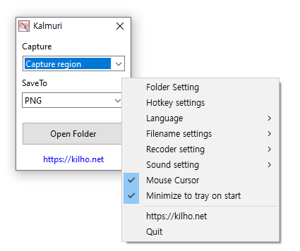

# Kalmuri

**用一个快捷键即可截取全屏、区域、窗口乃至整个网页,还能把屏幕录制成 MP4 视频的 Windows 免费截图工具。**

[English](README.md) · [한국어](README.ko.md) · 简体中文 · [日本語](README.ja.md) · [Español](README.es.md) · [Português (Brasil)](README.pt-BR.md) · [Français](README.fr.md)

> 本文档为翻译版本。如有出入,以[韩文版](README.ko.md)为准。

## 概述

使用 Kalmuri,只需先选好两件事 —— 截取什么(**捕获**)和怎样保存(**保存到**),之后按一下 `PrintScreen` 就能完成截图。不必每次都打开窗口或输入文件名,结果会按 `K-001.png`、`K-002.png` … 的顺序存进保存文件夹。

可以截取整个屏幕、固定位置的区域、用鼠标拖出的部分、正在使用的窗口、窗口里的某一个按钮,甚至需要滚动的整个网页。用同一个快捷键,还能把屏幕录制成 MP4 视频、提取屏幕上的颜色代码、把图片里的文字转成文本。

关闭窗口后,Kalmuri 仍会在通知区域(系统托盘)中运行,开一次就能随时用快捷键截图。

## 主要功能

- **7 种截取范围** — 全屏、指定区域、拖动选取的区域、活动窗口、窗口控件、整个网页、取色。
- **多种保存方式** — PNG · JPG · GIF · BMP · WebP 文件、MP4 视频、文字识别(TXT)、剪贴板、图片分享、打印机、浮在屏幕上(浮动)。
- **屏幕录制** — 把全屏或指定区域录制成 MP4,还可以同时录下电脑播放的声音。
- **整页网页截图** — 把在 Edge · Chrome 中打开的页面一直截到滚动的最底部,保存为一张图片。
- **文字识别(OCR)** — 把截取画面中的文字保存为文本文件。
- **取色** — 以 HEX · RGB · Web · TColor 格式复制光标下的颜色。
- **分享截图** — 把截图上传到网上并立即打开,方便分享地址。
- **浮动** — 把截取的图片停留在原位置并总在最前,方便参考。
- **用键盘调整区域** — 用方向键 · `Ctrl`+方向键 · `Shift`+方向键把区域精确到 1 像素。
- **便捷设置** — 修改快捷键、文件名格式(编号 · 日期时间)、截图声音、包含鼠标光标、开机启动。
- **8 种语言** — 韩语 · 英语 · 日语 · 中文 · 俄语 · 意大利语 · 法语 · 西班牙语。

## 下载 / 安装

| 类型 | 链接 |
|---|---|
| 安装版 | [下载](https://down.kilho.net/kalmuri?lang=zh) |
| 免安装版 (ZIP) | [下载](https://down.kilho.net/kalmuri?lang=zh&nosetup) |

安装版在安装完成后立即运行 Kalmuri,并开启 **系统启动时运行**,之后每次启动 Windows 都会在托盘中自动运行。免安装版解压 ZIP 后运行 `Kalmuri.exe` 即可。

免安装版只包含可执行文件,因此 **MP4 录制和 WebP 保存只能在安装版中使用**。其余功能两个版本相同。

## 使用方法

### 快速上手

1. 运行 Kalmuri 后会出现一个小窗口,通知区域里也会出现 Kalmuri 图标。
2. 在 **捕获** 中选择要截取什么。默认是 **全屏**。
3. 在 **保存到** 中选择怎样保存。默认是 **PNG**。选择 JPG · WebP 时旁边会出现画质框,选择 TXT 时会出现识别语言框。
4. 按 `PrintScreen`。伴随快门声完成截图,并以 `K-001.png` 保存到保存文件夹(默认是桌面)。
5. 点击 **打开文件夹** 即可打开保存文件夹查看结果。
6. 关闭窗口后 Kalmuri 仍在托盘中运行。点击托盘图标会重新显示窗口;在窗口或托盘图标上 **右键单击** 会出现设置菜单。

### 界面构成

**主窗口**

| 元素 | 作用 |
|---|---|
| **捕获** | 选择要截取什么(见下表) |
| **保存到** | 选择截图的保存方式(见下表)。JPG · WebP 旁会出现画质(100 ~ 60)框,TXT 旁会出现识别语言框 |
| **打开文件夹** | 用资源管理器打开保存文件夹 |
| **作者：吴吉浩** | 打开 Kalmuri 介绍页面 |

**捕获**

| 项目 | 截取的内容 |
|---|---|
| **全屏** | 整个屏幕 |
| **区域** | 红色边框窗口的内部 —— 每次都在相同位置截取相同大小时使用 |
| **拖动** | 按快捷键后用鼠标拖动选取的部分 |
| **活动窗口** | 正在使用的那一个窗口 |
| **窗口控制** | 鼠标光标下的窗口,或按钮·面板等窗口里的元素 |
| **浏览器** | 在 Edge · Chrome 中查看的整个网页(一直到滚动底部) |
| **取色器** | 鼠标光标下的颜色代码 |

**保存到**

| 项目 | 结果 |
|---|---|
| **PNG** · **JPG** · **GIF** · **BMP** · **WebP** | 对应格式的图片文件 |
| **MP4** | 屏幕录制(仅限全屏 · 区域) |
| **TXT** | 识别截取画面中的文字并保存为文本文件 |
| **剪贴板** | 不生成文件,只复制到剪贴板 |
| **上传Imgbox** | 上传到网上,并在浏览器中打开图片页面 |
| **打印机** | 立即打印 |
| **浮动** | 让图片停留在截取的位置并总在最前 |

**右键菜单**(主窗口或托盘图标)

| 项目 | 作用 |
|---|---|
| **打开保存文件夹** · **保存文件夹设置** | 打开或更改保存文件夹 |
| **截图设置** | **截图声音**(无 · 捕捉前的声音 · 捕捉后的声音) · **包含鼠标光标** · **含剪贴板** |
| **录制设置** | **限制录制时间**(无限制 · 30 分钟 · 1 小时 · 2 小时 · 4 小时) · **包含鼠标光标** · **包含声音** |
| **语言设置** | 界面语言 |
| **文件名设置** | **自动增量编号 #1** · **自动增量编号 #2** · **日期时间** |
| **快捷键设置** | 更改截图快捷键 |
| **系统启动时运行** | 启动 Windows 时在托盘中自动运行 |
| **作者：吴吉浩** · **退出** | 介绍页面 · 退出程序 |

### 这种情况怎么办

**一次截取整个屏幕**
把 **捕获** 保持为 **全屏**,按 `PrintScreen` 即可。不必打开窗口,只要 Kalmuri 在托盘中,在任何地方都能截图。

**每次都在相同位置截取相同大小**
选择 **区域** 后会出现一个红色闪烁的边框窗口。拖动边框移动位置、拖动边缘调整大小,然后按 `PrintScreen`,就只截取边框 **内部**。边框上方会显示当前大小(例如 `480x360`),边框的位置和大小会被记住,下次依然如此。点击右上角的 X 会关闭边框并回到 **全屏**。

**把区域精确到像素**
点一下区域边框窗口,然后使用键盘。方向键每次 **移动** 1 像素,`Ctrl`+方向键每次 10 像素、`Shift`+方向键每次 1 像素地 **调整大小**。先用鼠标大致对齐,再用键盘微调会很方便。

**保存常用的尺寸**
右键单击区域边框,会出现 `320x240` · `640x480` · `720x480` 等尺寸列表,一键即可切换。列表中的尺寸可在 **设置** 里输入 **自定义 #1 ~ #3** 的宽度·高度来更改。在 **当前状态** 中输入数字并点击 **应用**,可把当前区域调整为该尺寸。同一菜单中的 **隐藏** 只是暂时隐藏边框。

**用鼠标只选取需要的部分**
选择 **拖动** 后按 `PrintScreen`,屏幕会定格并变暗。用鼠标拖出要截取的部分,松开后只保存该部分。按 `Esc` 取消。因为截取的是定格的瞬间,连展开的菜单或一闪而过的通知也能截下来。

**只截取正在使用的窗口**
选择 **活动窗口**,点击要截取的窗口使其置于最前,然后按 `PrintScreen`。桌面和其他窗口都不会被截入,只保存该窗口。

**只截取窗口里的某个按钮或面板**
选择 **窗口控制** 后,鼠标光标下的元素会跟随一个虚线框。把光标移到想要的按钮·输入框·面板上并按 `PrintScreen`,就只保存框内的元素。给使用手册或咨询帖只截取某一部分时很方便。

**把长网页完整截成一张**
选择 **浏览器** 后,Kalmuri 会另外打开一个 Edge(没有则用 Chrome)窗口。在该窗口中打开想要的页面并按 `PrintScreen`,连需要往下滚动才能看到的部分在内,整个页面会被保存为一张图片。打开多个标签页时,截取当前正在查看的标签页。关闭该浏览器窗口后会回到 **全屏**。需要 Windows 8 及以上版本,并安装 Edge 或 Chrome。

**获取屏幕上的颜色代码**
选择 **取色器** 后,窗口中会实时显示鼠标光标下的颜色和代码。把光标放在需要的位置并按 `PrintScreen`,该颜色会加到列表最上方,同时复制到剪贴板。在列表上右键 → **格式** 可选择复制格式 **HEX**(`FF9933`) · **RGB**(`255, 153, 51`) · **Web**(`#FF9933`) · **TColor**(`$003399FF`),也可用同一菜单中的 **复制** · **删除** 整理列表。

**把屏幕录成视频**
把 **保存到** 设为 **MP4** 后按 `PrintScreen` 开始录制,窗口中会显示 **录制中** 和已录时间。再按一次 `PrintScreen` 停止录制并保存 MP4 文件。录制可用于 **全屏** 和 **区域**;录制区域时,边框上方会显示 `[REC]` 和时间,区域也会被固定住不会移动。

**连电脑播放的声音一起录**
开启 **录制设置 → 包含声音** 后,会在录制画面的同时录下电脑播放的声音(视频·游戏·提示音)。录制课程或视频播放画面时请开启。

**开着录制离开座位时**
把 **录制设置 → 限制录制时间** 设为 **30 分钟** · **1 小时** · **2 小时** · **4 小时** 之一,时间一到录制会自动停止。可以避免忘记停止录制而占满磁盘。

**录制视频中不显示鼠标光标**
关闭 **录制设置 → 包含鼠标光标** 后,视频中不会出现光标。它与截图用的 **截图设置 → 包含鼠标光标** 分开设置,可以做到截图不带光标、录制带光标。

**把图片里的文字转成文本**
把 **保存到** 设为 **TXT**,旁边会出现识别语言框。选择文字的语言后截图,会读取画面中的文字并保存为文本文件(`K-001.txt`)。适合转录无法复制的文档或图片中的文字。与 **拖动** 一起使用,可以只选取需要的段落来识别。语言列表是 Windows 中已安装的文字识别语言。

**截图后立即粘贴到别处**
把 **保存到** 设为 **剪贴板**,就不生成文件、只复制到剪贴板,可以用 `Ctrl`+`V` 直接粘贴到聊天软件或文档中。既想保存文件又想粘贴,请开启 **截图设置 → 含剪贴板**。无论以哪种格式保存,都会同时复制到剪贴板。

**用链接分享截图**
把 **保存到** 设为 **上传Imgbox** 后截图,图片会上传到网上,并在浏览器中打开该图片页面。复制地址发给别人,不用附加文件就能分享截图。

**截图后立即打印**
把 **保存到** 设为 **打印机**,截取的画面会立即用默认打印机打印。

**把截图浮在屏幕上作参考**
把 **保存到** 设为 **浮动** 后截图,在截取的位置会出现一张同样大小、总在其他窗口之上的图片。可以拖动移动,适合抄写数值或对比两个画面。在图片上右键 → **保存图像** 可保存为 PNG · JPG · GIF · BMP · WebP 文件,用 **删除浮动图像** · **删除所有浮动图像** 关闭。

**想让文件更小时**
把 **保存到** 设为 **JPG** 或 **WebP**,在旁边的画质框中从 100 · 90 · 80 · 70 · 60 中选择(默认 90)。数字越小,文件越小。文字多的画面适合 PNG,照片多的画面适合 JPG · WebP。

**更改文件命名规则**
在 **文件名设置** 中选择。
- **自动增量编号 #1**(默认) — 接着保存文件夹中最大的编号继续保存(`K-001`、`K-002` …)。
- **自动增量编号 #2** — 从空着的最小编号开始填补。如果删除了中间的文件,该编号会被再次使用。
- **日期时间** — 以截图时间命名(`K-20260928-153012345`)。适合按时间顺序整理多天的截图。

无论哪种规则,只要有同名文件,都不会覆盖,而是用新名称保存。

**更改保存文件夹**
在 **保存文件夹设置** 中选择想要的文件夹。默认是桌面。用 **打开保存文件夹**(或窗口中的 **打开文件夹**)随时可以打开该文件夹。

**更改快捷键**
在 **快捷键设置** 中勾选 `Ctrl` · `Alt` · `Shift`,选择按键后点击 **确定**。按键可从 `PrintScreen`、`A` ~ `Z`、`0` ~ `9`、`F1` ~ `F12`、`DEL` 中选择。如果该组合已被其他程序使用,会提示你,请换一个组合。

**按 `PrintScreen` 会打开 Windows 截图工具时**
Windows 11 有一项设置,按 `PrintScreen` 会打开截图工具。Kalmuri 在运行时会关闭这项设置,让 `PrintScreen` 由 Kalmuri 响应。

**更改截图声音**
在 **截图设置 → 截图声音** 中选择 **无** · **捕捉前的声音**(默认) · **捕捉后的声音**。安静的场合用 **无**;想用声音确认已保存完毕,用 **捕捉后的声音**。

**截图中包含或去掉鼠标光标**
开启 **截图设置 → 包含鼠标光标**(默认)后,截图中也会带上光标。需要指示按钮位置的说明图可以开启,想要干净的画面就关闭。

**启动 Windows 时自动准备好**
开启 **系统启动时运行** 后,Windows 启动时 Kalmuri 会不显示窗口、直接在托盘中运行,随时可以用快捷键截图。安装版默认已开启。

**关闭窗口后继续使用,或彻底退出**
窗口的 X 不会退出 Kalmuri,只是把它隐藏到托盘。要彻底退出,请点击右键菜单中的 **退出** 并确认。正在录制时,请先停止录制再退出。

**更改界面语言**
在 **语言设置** 中选择 한국어 · English · 日本語 · 中文 · Русский · Italiano · Français · Español,即可立即切换。

### 版权提示

用 Kalmuri 截取或录制的画面中可能包含他人的文字、图片、视频或音乐。超出个人保存和参考范围进行分享或发布时,可能需要原权利人的许可,请遵守各服务的使用条款和著作权法。

## 设置

所有设置在更改后立即保存,下次启动时继续使用。

| 项目 | 默认值 |
|---|---|
| 捕获 | 全屏 |
| 保存到 | PNG |
| JPG · WebP 画质 | 90 |
| 保存文件夹 | 桌面 |
| 文件名设置 | 自动增量编号 #1 |
| 快捷键 | `PrintScreen` |
| 截图声音 | 捕捉前的声音 |
| 包含鼠标光标(截图 · 录制) | 开 |
| 含剪贴板 | 关 |
| 限制录制时间 | 无限制 |
| 包含声音 | 关 |
| 系统启动时运行 | 安装版为开 |
| 语言 | 跟随 Windows 区域设置(不支持的语言则为英语) |

## 系统要求

- Windows 10 · Windows 11
- **浏览器** 截图需要 Microsoft Edge 或 Google Chrome。
- **TXT**(文字识别)使用 Windows 中已安装的文字识别语言。
- 网络连接仅用于新版本提示、**上传Imgbox** 和 **浏览器** 截图。

## 更新

Kalmuri **不会** 自动更新。启动时检查是否有新版本并弹出提示窗口,按 **[是]** 会打开下载页面并退出程序。新版本经内部验证后手动发布,并在 [Kalmuri 页面](https://kilho.net/kalmuri)公告。请参阅[更新政策说明](https://en.kilho.net/archives/notice/2940)。

**版本历史**

| 版本 | 日期 | 内容 |
|---|---|---|
| 4.3.1 | 2026-09-28 | 加强图片上传安全,WebP 保存更稳定,录制启动更稳定,屏幕·拖动截图更稳定,快速连续截图时也保留已有文件,改进防止重复运行以及区域窗口大小·位置的保存 |
| 4.3.0 | 2026-08-28 | 网页截图全新打造 —— 配合最新的 Edge · Chrome 更快更稳定,长页面一直截到底并保存为一张,自动查找已安装的浏览器,在多个窗口·标签页中准确截取正在查看的页面 |
| 4.2.7 | 2026-08-14 | 网页截图和保存文件夹选择更稳定 |
| 4.2.6 | 2026-07-23 | 网页浏览器截图更稳定,录制时固定区域,录制标识更清晰,改进 OCR 文本保存以及韩文·特殊字符兼容性 |

## 许可证

Kalmuri 是 **免费软件**。公司、家庭、政府机关、学校等任何地方都可无限制免费使用,并可自由再分发。

## 链接

- 官网: <https://kilho.net/kalmuri>
- 论坛: <https://groups.google.com/g/kilhonet>
- X (Twitter): <https://www.twitter.com/kilhonet>

© KILHO.NET
